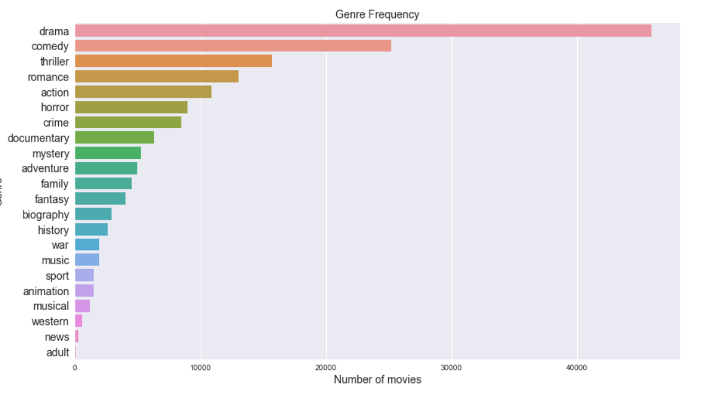

# Classify movies genres from text data using Neural Networks

For this project I scraped data from Imdb.com website. The goal of this project is to try and see if it is possible to train Neural Network to classify movie genres using movie description as input and list of genres as output.

### Multi label classification problem

Movies often have multiple genres, such as adventure in a spy movie, or crime in a science fiction movie. Usually one genre is predominant. For example drama listed as genre for about 60 % of all movies. And if you look deeper all movies are essentially dramas.

So you can't classify movies by single genre. There are 22 unique genres on imdb and every movie has three or more genres.

### Quality vs Quantity

The data I used is scraped from IMDB. There are two movie descriptions on the website:

**Short summary** 
- Length       50-200 symbols
- Quantity     90k items    

**Synopsis** 
- Length        500-10 000 symbols
- Quantity      11k items

Dataset contains much more summaries while synopsises contain more information. I experimented with both to see which one works better. To solve this problem I used Recurrent Neural Networks (RNN) with Keras.

### Clean and prepare Data

First of all I need to have a clean text. That means to get rid of punctuation and stopwords. Clean text looks like this:

Next step is to build vocabulary from text corpus and assign vectors to words usind Word2vec library. Also keras require to have embedding matrix under weights parameter in the embedding layer. Embedding matrix consists of all words in the text corpus with the correspondding vectors. The w2v dimension is the size of embedding layer.

Then One hot encode genres and transform texts into sequences of numbers. All input values have to be the same dimesion so we need to pad all sequences to match the longest text.

### Modelling

I am going to use Bidirectional LSTM as hidden layer. Bidirectional LSTMs are an extension to typical LSTMs that can enhance performance of the model on sequence classification problems. Here is the model architecture:

I experimented with the number of epochs and came to a conclusion that it starts overfitting after about 30 epochs for both datasets:

### Results

Model shows nice validation accuracy. But what does it really mean for multiclass problem. At what point we can say that this genre belongs to this movie. Also I would like to see not only numbers but textual result. 
When we make a prediction for single movie description we get a list with 22 probabilities. 

Now we need to find a level at we can accept that this genre belongs to this movie. One way to do that is to check model's accuracy on different levels and find the best one. In order to do that I used the F-score on different levels. The F-score is a way of combining the precision and recall of the model, and it is defined as the harmonic mean of the model's precision and recall.

First we apply filter to a list of probabilities. It will assign 1 to numbers larger then threshold value and 0 to the rest. Then we compare it to actuall data using F-score: Below you can see the results for both datasets:

**Short summary:**

**Synopsis:**

And know predictions at 0.3 threshold:

**Short summary:**

**Synopsis:**

### Conclusion

Trivia model turned out to be slightly better. The results for both models are pretty satisfying. The best threshold turned out to be 0.3 which means genre must get 30% probability of occurence to be assigned to a movie. The F1 score of ~0.6 is pretty good considering number of labels: 22 for tirvia and 21 for synopsis.

Future work would be:

- Train data on more examples
- Test more model architechtures
